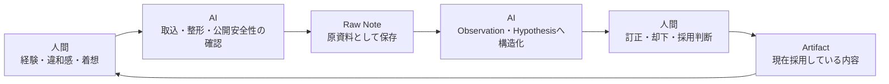

# このメモの位置づけ

別のCodexスレッドで、このRepositoryの構造と、
そこから見える人間・AIの協業モデルを分析した結果が共有された。

この分析自体を、PEK2026登壇のネタ候補として記録する。

共有された文章は別スレッドのAIによる解釈を含む。
したがって、Repositoryから確認できる挙動、
人間が今回着目した主張、
まだ検証されていない解釈を分けて扱う。

共有文に含まれていた一時的なBranch状態やローカルFilesystemの情報は、
登壇ネタに必要がないため記録しない。

# ユーザーが着目したネタ

AI活用で狙えるOutcomeは、成果物を生成してスピードを上げることだけではない。

候補となる対比:

- 成果物を生成する
  - 作業時間を短くする
  - Deliveryの速度を上げる
- Second Brain的に使う
  - 興味や探索の領域を広げる
  - 過去の知識を再利用しやすくする
  - 意思決定品質の向上を狙う
- 構造化、反証、追跡に使う
  - 何が事実、経験、仮説、解釈、採用判断かを分ける
  - 暗黙の前提やReasoning Chainの欠落を見つける
  - 人間が後から判断を訂正、却下、採用できる状態にする

候補となる問い:

> 皆さんは、AIで何のOutcomeを出そうとしていますか。

候補となる主張:

> 成果物を速く作ることだけがAIのOutcomeではありません。
> 探索範囲を広げることも、
> 人間が作った仮説を疑わせて意思決定品質を上げることも、
> AI活用のOutcomeとして設計できます。

# AI活用のOutcome分類候補

## 1. 生成速度

AIに成果物を生成させる。

期待するOutcome:

- 作業時間の短縮
- Feature、文書、Code、Testなどの生成速度向上
- Delivery Lead Timeの短縮

主な注意:

- 生成量や実装速度が増えても、利用者価値が増えたとは限らない
- DiscoveryとDecisionが弱いままDeliveryだけが速くなる可能性がある

## 2. 認知と探索の拡張

AIをSecond Brainとして使う。

期待するOutcome:

- 過去の記録へアクセスしやすくなる
- 関連する論点や知識を発見しやすくなる
- 一人では見つけにくい視点を比較できる
- 興味や探索の領域が広がる

主な注意:

- 情報が増えることと、判断が良くなることは同じではない
- AIが追加した解釈を、人間自身の考えと混同する可能性がある
- 検索できることと、SourceのAuthorityを判断できることは別である

## 3. 意思決定品質

AIを、記録、構造化、反証、追跡へ使う。

期待するOutcome:

- 未検証の仮説や暗黙の前提が見えやすくなる
- Problem、Value、Solution、Featureの混同を減らす
- 複数の解釈や反例を比較できる
- 人間の訂正、却下、採用判断を追跡できる
- 後からReasoning Chainを再構成できる

主な注意:

- AIが正しい意思決定を代行するわけではない
- 論理が通っていることは、仮説が事実であることを意味しない
- 意思決定品質が実際に向上したかは、別途検証が必要である

## 4. 組織学習とTraceability

AIとRepositoryを組み合わせ、判断過程を再利用可能な形で残す。

期待するOutcome:

- 完成物だけでなく、仮説と訂正の履歴を共有できる
- 過去の判断理由を後から説明できる
- 見落としを次のDiscoveryとDecisionへ戻せる
- 個人の経験を、出典と不確実性を伴う組織知へ変換できる

# Repositoryから読み取られた協業モデル

共有された分析では、このRepositoryの協業構造を次のように表現していた。



候補となる役割分担:

| 局面 | 人間 | AI |
| --- | --- | --- |
| 着想 | 現場経験、違和感、話したいことを出す | 記入環境や空のRaw Noteを用意する |
| 原資料化 | 記録が意図と合うか確認する | 会話を取り込み、由来を分け、公開可能な形へ整える |
| 分析 | 解釈が意図と合うか判断する | ObservationやHypothesis Episodeへ構造化する |
| 検証 | 実際の経験、外部Source、判断を提供する | 未検証部分、支持、限界、反例候補を明示する |
| 採用 | 何を現在の結論とするか決める | 採用内容をArtifactへ反映し、Sourceとの接続を保つ |
| 回想 | 何を重視し、何を変えるか決める | Sourceをたどり、Reasoning Chainを再構成する |

# AIの役割候補

共有された分析では、AIは単なる文章生成役ではなく、
次の役割を兼ねていると解釈された。

## 記録係

- 会話や粗いメモをRepositoryへ移す
- SourceとCapture Contextを記録する
- 人間の低構造な入力を消さずに保存する

## 編集・安全管理役

- 公開すべきでない顧客、案件、個人、内部情報を検出する
- 分析に必要な意味を残しながら一般化する
- 公開前にSanitization状態を明示する

## 認識論的な整理役

- Source Statement
- Observation
- Interpretation
- Hypothesis
- Validation Result
- Decision
- Adopted Artifact

これらを同じ確度の情報として混ぜない。

## 検証・反証役

- 人間のReasoning Chainの不足を探す
- 暗黙の前提と未検証部分を示す
- 反例、失敗モード、別のSolution Optionを出す
- AI自身が追加した解釈を明示する

# Repository上の具体例候補

## AIが追加した概念を人間が訂正した例

`RN-20260730-095321-work-mode-idea-supplement`では、
Workモードが追加した用語を、
人間が「元の会話に由来する自分の着想ではない」と訂正した。

この例から示せること:

- AIの追加解釈を、人間の意見へ黙って混ぜない
- 出典とOriginを後から確認できる
- 人間が採否を取り戻せる
- 訂正前の状態も履歴として残る

## 未検証の主張を未検証として残す例

`HYP-20260730-015718-ai-speed-requires-value-validation`は、
セッションの中核に近い主張であっても、
Evidenceがなければ`not_tested`としている。

この例から示せること:

- セッションで使いたい主張であることと、検証済みであることを分ける
- AIがもっともらしく説明できてもEvidenceにはしない
- Researchや実地観測で確認すべき対象を残す

## 採用判断を人間に残す例

`03_artifacts/attendee-journey.md`では、
人間による採用判断と、そこへ至るSourceやAnalysisを分離している。

この例から示せること:

- AIが整理した内容と、現在の採用内容を分ける
- 人間が意味と採用責任を持つ
- ArtifactからReasoning Chainをたどれる

# 候補となる協業モデルの表現

候補1:

> 人間が意図、経験、価値判断を持ち、
> AIがそれを追跡可能な知識へ変換する。

候補2:

> 人間が粗く考え、AIが整え、
> 人間が訂正し、AIが分析し、
> 人間が採用する。

候補3:

> AIは真実を決める共同著者ではなく、
> 人間の思考をEvidence付きのReasoning Chainへコンパイルする協業者です。

候補4:

> 人間は最後の承認者であるだけではありません。
> 経験の提供者、意味の所有者、
> そしてAIの混入や過剰解釈を訂正する編集責任者です。

# 登壇準備そのものを実例にする

表向きの成果物はPEK2026の登壇資料である。

一方、このRepositoryには次が残る。

- 人間が粗い状態で考えたこと
- AIがどのように解釈、構造化したか
- AIがどこまで追加展開したか
- 人間が何を訂正、却下、採用したか
- 未検証のまま残っているもの
- 最終成果物がどの判断から生まれたか

したがって、このRepositoryは次の候補になり得る。

> AIを思考と意思決定のProcessへ安全に組み込むための、
> 実行Log付き参照実装。

また、今回のセッションテーマを準備過程そのもので実践している。

- AIに成果物を全面生成させるのではない
- AIを記録、構造化、反証、追跡へ使う
- 人間が価値判断と採用責任を持つ
- 見落としと訂正を次の判断へ戻す

# トークへの接続候補

## Reasoning Chain強度チェックの前

```text
AIでDeliveryを速くする
        ↓
AIでDiscoverとDecideの品質向上も狙う
        ↓
人間が価値判断と採用責任を持つ
```

候補となる説明:

> AIにFeatureを作らせるだけではなく、
> 人間が作ったProblem、Value、Solutionの仮説を疑わせる。
> それもAI活用で出せるOutcomeの一つです。

## Repositoryをお土産として紹介するとき

候補となる説明:

> このRepositoryは、完成した資料を置く場所だけではありません。
> 人間が何を考え、AIが何を追加し、
> 人間が何を訂正して採用したかを追跡できるようにしています。

## 終盤のMeta Story

候補となる説明:

> 今日ご紹介した「AIに作らせる前にAIに疑わせる」を、
> この登壇準備そのものでも試しています。
> AIで生成速度だけを上げるのではなく、
> 意思決定品質とTraceabilityをOutcomeとして狙っています。

# Evidenceと未検証部分

Repositoryから確認できる挙動候補:

- AIが追加した用語を人間が訂正した
- Raw Note、Hypothesis、ArtifactのAuthorityが分離されている
- 未検証の主張が`not_tested`として残っている
- 人間の採用判断がArtifactに記録されている

これらから直接は証明できないこと:

- 人間の意思決定品質が実際に向上した
- AIを使わない場合より良い結論へ到達した
- 同じ協業モデルが他の人や組織でも有効である
- Repository運用コストより効果が大きい

したがって、現時点のValue Hypothesis候補は次である。

> AIを記録、構造化、反証、追跡へ使い、
> 人間の意図、Evidence、訂正、採用判断を分離して残すことで、
> 意思決定品質と組織学習を高められる可能性がある。

# 未決事項

- AI活用のOutcomeを三分類にするか、組織学習を含む四分類にするか
- `Second Brain`と`意思決定品質`を同じ分類に置くか、分けるか
- Repositoryを本編の実例にするか、終盤のお土産紹介に限定するか
- 「Reasoning Chainへコンパイルする」という表現が参加者に伝わるか
- 意思決定品質向上を、今後どのSignalで検証するか
- Repository運用の負担や失敗例も併せて見せるか

## 訂正履歴

### CR-20260730-103327

- corrected_at: 2026-07-30T10:33:27+09:00
- corrected_by: human:kijima
- target: 「ユーザーが着目したネタ」のOutcome分類、および「未決事項」の`Second Brain`と`意思決定品質`の関係
- correction: `Second Brain`をOutcome分類の見出しとして扱わず、「生成速度を上げる」「認知・探索の領域を広げる」「意思決定品質を上げる」を同じ階層のOutcomeとして扱う。「構造化、反証、追跡」は、意思決定品質の向上を狙う具体的なAI活用方法として位置づける。
- reason: `Second Brain`はAIの利用形態を表す語であり、Outcomeを表す他の分類と抽象度が揃っていなかった。また、「意思決定品質の向上」と「構造化、反証、追跡」は別分類ではなく、Outcomeとそれを実現する手段の関係にあるため。

訂正後の分類:

- 生成速度を上げる
  - 成果物を生成する
  - 作業時間を短くする
  - Deliveryの速度を上げる
- 認知・探索の領域を広げる
  - 過去の知識を再利用しやすくする
  - 関連する論点や知識を発見する
  - 一人では見つけにくい視点へ探索を広げる
- 意思決定品質を上げる
  - 何が事実、経験、仮説、解釈、採用判断かを構造化する
  - 暗黙の前提やReasoning Chainの欠落を反証的に確認する
  - 人間による訂正、却下、採用判断を追跡可能にする

`Second Brain`という語を残す場合は、認知・探索の拡張や意思決定支援を
実現する利用形態の一例として扱い、Outcome分類そのものには使用しない。
