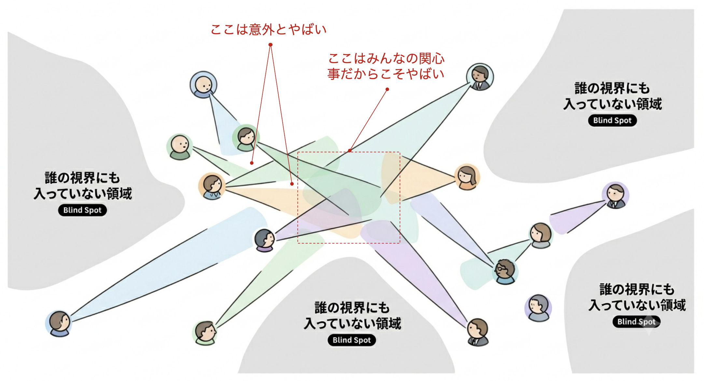

# メモ

RN-20260801-121633-platform-user-choice-hypothesis

今現状私が接する機会のある方々は、プラットフォームを選べることの価値を疑ってない。

私も疑ってなかった。いや私は選びたい方なんだけどさ。
本来ならプラットフォームを選びたいユーザーと、選びたいとも思わないユーザーがいるってことですね。

これはセッションの中で扱うと話が発散するから扱わない。
ここに見に来るほど勉強した人が取り出せる情報としておいてあればよし。

## 仮説検証

仮説検証ってのは自分あるいはチームの思い込みかもしれないものを徹底的に裏どりするっていう類のものなんですよね。
この場合の裏どりは、「そうであること」も調べるし、「そうではないと言える材料がないか」の両方を調べる。
こうすることで、「正しい」「正しくない」の二元論ではなく、どの程度確からしいかを確認しながら進む方法。

「この辺確かじゃないかも」「であれば確かじゃない場合にはどうする？進め方に対して影響大きい？」まで突き詰めるんですよ。
つまり仮説検証ってのはプロセスの中に不確実性に対するリスク管理が入ってるってことなんです。

シンプルに言うとこうシンプルなんだけど、案外難しい。

これはなぜかというと、以下の図のような状況が発生するから。

--> この画像そのものは過去に別件で生成したもの。このRepoとは直接的な関係はなし。

人の集団は自分たちが全て見えていると思いがちだけど、案外抜け漏れがあるし、背後にあるものは気が付かない。

これをうまくやろうとするとメタ認知の強さが必要になるんだよなあ。
(Known Known/Known Unknown/Unknown Known/Unknown Unknown)

プラットフォームユーザーが案外プラットフォームを選びたがっていないかもしれないってのは典型的なUnknown Unknown。
このRepoでは私は物語の作者として知っているが、物語内のプロジェクトチームは気がつかないものとする。

仮説検証をベースとしたプロセスは、想定外の利用なんかも観測し、それまでUnknown Unknownだった事象も、Known Unknownの領域に移動する手掛かりになる。
あくまで "Potentially"。やり方がうまければ。

ちなみに多分Platform Advisorがこけるとすると、最初は物珍しくてみんな使うけど、Platform Advisorがそのうち使われなくなるか、あるいはプロジェクトの意思決定に影響のある使われ方をしないという結果が出ると思われる。

仮説検証はValue Hypothesisそのものが正しかったかも含めて検証するので、Platform AdvisorのValue Hypothesisが正しかったかをメトリックで計測するのも重要ですね。
これが本来欲しいフィードバックループ。
そこまでちゃんとメトリック設計できれば、Platform Advisorの隠し仮説まで検証できるんじゃなかろうか。

こういうのは数値的なメトリック取得だけでは難しいので、対象ユーザーからサンプリングでインタビューがいいだろうなあ。採用しなかった人がインタビュー対象に含まれていたら、筋がいいと思う。

検証方法ごとの限界とコツはUI/UXの世界にたんまり蓄積されているからここではこれ以上は割愛。
とにかく図で表現された「Blind Spot」はとにかく潰すのが難しいと思っておけばここでは良い。

## 仮説検証に対するありそうな誤解

仮説検証をやっていれば自動的にいいものができるんじゃないんですよね。

仮説検証でやってたら「自分自身の打率がわかる」です。
打率が良くなることそのものは仮説検証アプローチは担保しない。
ただし「ここに抜け漏れありましたよ」「あなたはこういう観点のものであれば打率がいいですよね」がわかるから、改善の手がかりが得られる。

つまり仮説検証そのものは打率を明らかにし、改善の手がかりを得られる方法論で、それをいかにうまくできたかが打率を押し上げる。
打率はプロダクトの「刺さり方」に直結する。特にValue Hypothesisは大きな影響あり。

という関係性があるから、OVSへ価値ある変化を起こしたいなら、DVSそのものをきっちり整える必要があるんだよなあ。

## 訂正履歴

<!-- 誤りを直す場合は元の記述を消さず、provenance-schema.mdの形式で追記する。 -->
